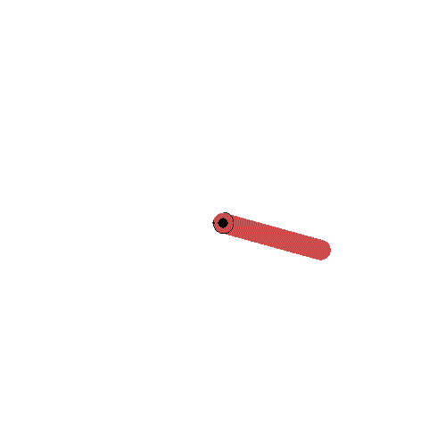

# custom_gym_envs

A set of custom `gym` environments for testing and research. Below are short descriptions and examples for each environment.

| Environment name | Description | Illustration |
| :--- | :--- | :---: |
| `cartpole-continuous-v0` | The basic `gym` environment adapted for continuous actions in `[-1,1]`, slightly modified from <a href="https://gist.github.com/iandanforth/e3ffb67cf3623153e968f2afdfb01dc8">this source</a>. Useful for testing of continuous agents. See additional details <a href="cartpole/README.md">here</a>. |  |
| `lorenz-oscillator-discrete-v0` | Environment for the control of the chaotic Lorenz attractor with discrete actions, the objective being to **maximize** the number sign changes of the `x` coordinate. Adapted and extended from <a href="https://arxiv.org/pdf/2003.14358.pdf">this source</a>. See additional details <a href="lorenz/README.md">here</a>.  |  |
| `lorenz-stabilizer-discrete-v0` | Environment for the control of the chaotic Lorenz attractor with discrete actions, the objective being to **minimize** the number sign changes of the `x` coordinate. Adapted and extended from <a href="https://arxiv.org/pdf/2003.14358.pdf">this source</a>. See additional details <a href="lorenz/README.md">here</a>.  |  |
| `pendulum-deterministic-v0` | The basic `gym` environment with no initial state variability. Useful for testing of continuous agents. See additional details <a href="pendulum/README.md">here</a>. |  |
