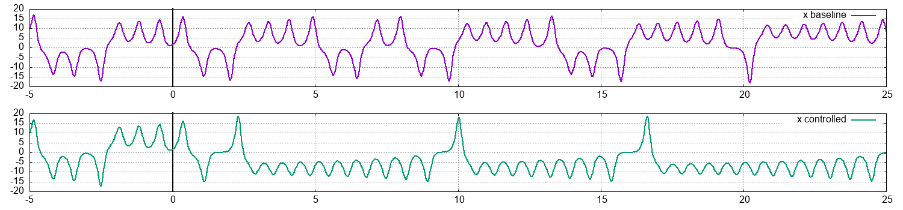
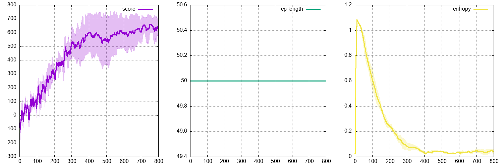

# `lorenz` environments

A set of gym environments for the control of the Lorenz attractor, strongly inspired from <a href="https://research.tue.nl/files/146730787/Beintema_afstudeerverslag.pdf">this thesis</a>. Time integration is delegated to `scipy.odeint`. Control is applied to the Lorenz attractor on the y derivative:

<p align="center">
  
</p>

Discrete control is used, authorized values for `a` being `{-1,0,1}`. In all cases, the control is applied every half unit of time. The system is evolved from a fixed initial condition for 5 units of time, after which control kicks in for 25 units of time (on the following plots, the start of control is shown by a black vertical line). The runs below were obtained using an in-house PPO code.

## ```lorenz-oscillator-discrete-v0```

The first environment aims at maximizing the number of sign changes of the `x` component. Reward is consistently 0, except when x sign changes, in which case it is +1 (hence this is a sparse reward environment). The control-less environments has a cumulated reward of 10, the current controlled example has a cumulated reward of 25:

<p align="center">
  
</p>

<p align="center">
  
</p>

<p align="center">
  
</p>

## ```lorenz-stabilizer-discrete-v0```

The second environment aims at minimizing the number of sign changes of the `x` component. Reward is consistently 1 for each step with negative x, and consistently -1 for each step with positive x (hence this is a dense reward environment). The control-less environments has a reward of -356. The current controlled example has a cumulated reward of 620:

<p align="center">
  
</p>

<p align="center">
  
</p>

<p align="center">
  
</p>
