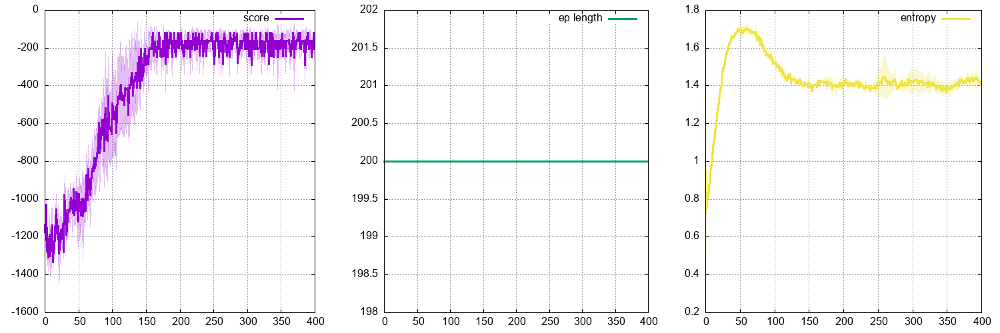

# `pendulum-deterministic-v0`

Continuous pendulum environment with no initial state variability. In the original environment, the initial states are:

```
high = np.array([np.pi, 1])
self.state = self.np_random.uniform(low=-high, high=high)
```

Here, the initial state is simply:

```
self.state = np.array([0.0, 0.0])
```

Below is an example of training with an in-house PPO method.

<p align="center">
  
</p>
